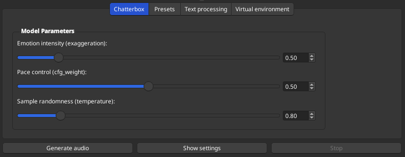
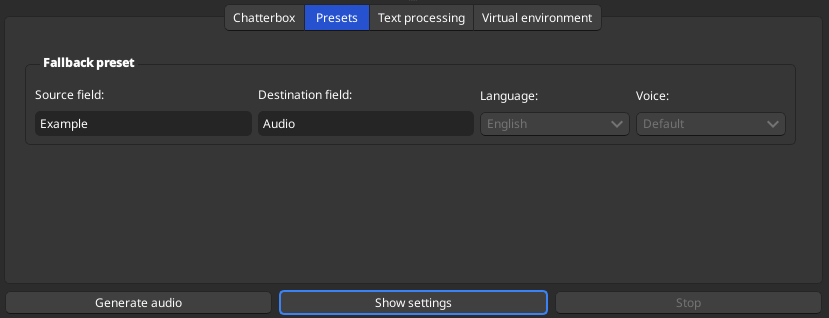
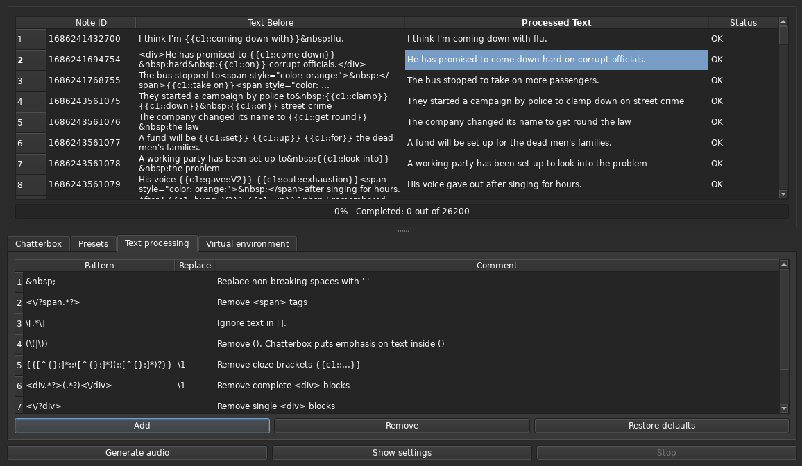
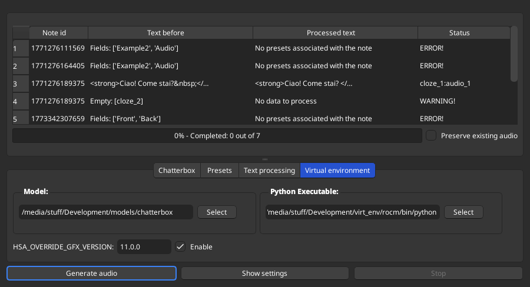

# Installation & Requirements

-   **Environment Management:** Uses **Conda** to create a dedicated virtual environment, ensuring all dependencies are isolated and stable.
-   **Hardware Acceleration:**
    -   **NVIDIA (Windows/Linux):** Full **CUDA support** for high-speed generation.
    -   **AMD (Linux):** Supports **ROCm** for GPU acceleration on compatible hardware.
    -   **Apple Silicon (macOS):** Leverages **MPS** (Metal Performance Shaders).
    -   **Fallback:** Systems without a compatible GPU will default to **CPU inference**.
-   **Storage Space:** Please ensure you have adequate disk space before installation:
    -   **Model Weights:** ~10 GB (ChatterboxTTS).
    -   **Virtual Environment:** ~7 GB for standard setups, or up to **20 GB** for ROCm/GPU dependencies.

## Tested Environments

The following configurations have been verified to work with this addon:

-   **Linux (Fedora 43)**
    -   **Anki Version:** `25.09.2` (Build `3890e12c`)
    -   **Python/Qt:** `3.13.11` (Qt `6.10.2`) and `3.14.3` (Qt `6.10.2`)
    -   **Installation Methods:** Flatpak and `pip` versions
    -   **Hardware Accel:** Verified both with and without **ROCm**

-   **Windows**
    -   **Anki Version:** `25.09.2`
    -   **Python/Qt:** `3.13.5` (Qt `6.9.1`)

# Prerequisites

Conda is a powerful command line tool for package and environment management. We need it, because chatterbox is finicky about what python version you use.

> The current chatterbox release [0.1.6](https://github.com/resemble-ai/chatterbox/blob/master/pyproject.toml) supports only python 3.10 and 3.11. Using any others will probably cause a lot of import/dependency errors.

`conda` installers for Linux, Windows and MacOS are available on [their website](https://www.anaconda.com/download/success?reg=skipped). Just choose minimal installer (Miniconda) and run it with default parameters. On Linux/MacOS you need to make the file executable first `chmod +x Miniconda3-latest-Linux-x86_64.sh`. 

[How to install miniconda](https://www.anaconda.com/docs/getting-started/miniconda/install)

## Setting up ChatterboxTTS

### Create virtual environment

```bash
conda create -yn chatterbox python=3.11
conda activate chatterbox

pip install chatterbox-tts
```

> You can also use full paths instead of the name of the environment:

```bash
conda activate C:\Users\test\miniconda3\envs\chatterbox_test
```

### Download model

- ChatterboxMultilingualTTS and ChatterboxTTS

> The addon is currently using this model to generate audio. ChatterboxTTS supports only English, but it adds fewer artifacts than ChatterboxMultilingualTTS.

```bash
python3 -c "from huggingface_hub import snapshot_download; snapshot_download(repo_id='ResembleAI/chatterbox', local_dir='chatterbox')"
```

 - Chatterbox Turbo
   
```bash
python3 -c "from huggingface_hub import snapshot_download; snapshot_download(repo_id='ResembleAI/chatterbox-turbo', local_dir='chatterbox-turbo')"
```

### Test

 Try running the following script in the virtual environment. It should generate an audio file in the same folder:
 
 ```bash
HF_HUB_OFFLINE=1 python example.py 
 ```

### example.py
```python
import torchaudio as ta
import torch
from chatterbox.tts import ChatterboxTTS

# Automatically detect the best available device
if torch.cuda.is_available():
    device = "cuda"
elif torch.backends.mps.is_available():
    device = "mps"
else:
    device = "cpu"

print(f"Using device: {device}")

model_path = "/absolute/path/to/the/model"
model = ChatterboxTTS.from_local(ckpt_dir=model_path, device=device)

text = "Ezreal and Jinx teamed up with Ahri, Yasuo, and Teemo to take down the enemy's Nexus in an epic late-game pentakill."
wav = model.generate(text)
ta.save("test-1.wav", wav, model.sr)
```

### Errors

#### TypeError: 'NoneType' object is not callable

 Perth v1.0.1: https://github.com/resemble-ai/chatterbox/issues/198

```bash
    self.watermarker = perth.PerthImplicitWatermarker()
                       ^^^^^^^^^^^^^^^^^^^^^^^^^^^^^^^^
TypeError: 'NoneType' object is not callable
```

## ROCm

ROCm (Radeon Open Compute) is AMD's open-source alternative to NVIDIA's proprietary CUDA platform. If you have a Radeon GPU and you're using Linux this part is for you.

https://rocm.docs.amd.com/en/latest/reference/gpu-arch-specs.html

> I don't know if it's possible to set up ROCm and Chatterbox on Windows even though the table from above apllies to Windows and Linux. If you manage to set it up, do let me know and I'll update the guide.

## Dependencies

I show how to set it up on Fedora 42+, in other distibutions the names of the packages will be slightly different. Nonetheless, everything after this part should work on any Linux distribution.

```bash
sudo dnf install rocm-hip rocminfo rocm-smi
```

```
Name            : rocm-hip
Version         : 6.3.1
Description     : HIP is a C++ Runtime API and Kernel Language that allows developers to create          
                : portable applications for AMD and NVIDIA GPUs from the same source code.

Name            : rocm-smi
Version         : 6.3.1
Description     : The ROCm System Management Interface Library, or ROCm SMI library, is part of
                : the Radeon Open Compute ROCm software stack . It is a C library for Linux that
                : provides a user space interface for applications to monitor and control GPU
                : applications.

Name            : rocminfo
Version         : 6.3.0
Description     : ROCm system info utility
```

### Create groups and add your user to them

```bash
sudo usermod -a -G render $LOGNAME
sudo usermod -a -G video $LOGNAME
```

Reboot and after that check that ROCm is installed properly with command `rocminfo`

### Create and activate a new conda environment

```bash
conda create -n chatterbox python=3.11
conda activate chatterbox
```

### PyTorch

ChatterBox relies on torch==2.6.0 and torchausio==2.6.0 (https://github.com/resemble-ai/chatterbox/blob/master/pyproject.toml), and the latest rocm version compatible with them both is 6.2.4

```bash
pip3 --no-cache install torch==2.6.0 torchaudio==2.6.0 --index-url https://download.pytorch.org/whl/rocm6.2.4
```

You can find what torch version is compatible with rocm by using the website `https://download.pytorch.org/whl/` and clicking through versions or run the bash script:

```bash
#!/bin/bash

BASE_URL="https://download.pytorch.org/whl"
ROCM_VERSIONS=$(curl -s $BASE_URL | grep -oP rocm[0-9]+\(\.[0-9]+\)* | uniq)

VERSION="torch-2.6"

for i in $ROCM_VERSIONS; do
    ROCM="$BASE_URL/$i/torch"
    COMPATIBLE=$(curl -s "$ROCM" | grep -o "$VERSION" | uniq)
    echo $ROCM
    if ! [ -z "$COMPATIBLE" ]; then
       echo "$COMPATIBLE"
   fi
done
```

```bash
https://download.pytorch.org/whl/rocm6.1/torch
torch-2.6
https://download.pytorch.org/whl/rocm6.2/torch
https://download.pytorch.org/whl/rocm6.2.4/torch
torch-2.6
```

### Install Chatterbox TTS

```bash
cd .conda
git clone https://github.com/resemble-ai/chatterbox.git
cd chatterbox
pip --no-cache install -e .
```

> Don't delete or move the chatterbox folder after installing. If you did that, just reinstall it `pip --no-cache install -e` in the conda environment one more time.

### Environment variables

Before we can run an application that depends on ROCm, we need to present our GPU as supported. This requires setting HSA_OVERRIDE_GFX_VERSION environment variable. (https://discuss.linuxcontainers.org/t/rocm-and-pytorch-on-amd-apu-or-gpu-ai/19743)

- for GCN 5th gen based GPUs and APUs `HSA_OVERRIDE_GFX_VERSION=9.0.0`
- for RDNA 1 based GPUs and APUs `HSA_OVERRIDE_GFX_VERSION=10.1.0`
- for RDNA 2 based GPUs and APUs `HSA_OVERRIDE_GFX_VERSION=10.3.0`
- for RDNA 3 based GPUs and APUs `HSA_OVERRIDE_GFX_VERSION=11.0.0`

You can try to find your GPU in the table https://rocm.docs.amd.com/en/latest/reference/gpu-arch-specs.html

> Setting up the variable should eliminate the error `Compile with `TORCH_USE_HIP_DSA` to enable device-side assertions`

I'm using Radeon RX 7600, so `HSA_OVERRIDE_GFX_VERSION=11.0.0` is my choice

You can either add `HSA_OVERRIDE_GFX_VERSION=11.0.0` to your ~/.profile
```
export HSA_OVERRIDE_GFX_VERSION=11.0.0
```
or set it up before running the script
```
HSA_OVERRIDE_GFX_VERSION=11.0.0 python3 create_audio.py
```

### Check ROCm support

Create a new python script and run it in the virtual environment:

```bash
python <script-name>.py
```

```python
import torch, grp, pwd, os, subprocess
devices = []
try:
	print("\n\nChecking ROCM support...")
	result = subprocess.run(['rocminfo'], stdout=subprocess.PIPE)
	cmd_str = result.stdout.decode('utf-8')
	cmd_split = cmd_str.split('Agent ')
	for part in cmd_split:
		item_single = part[0:1]
		item_double = part[0:2]
		if item_single.isnumeric() or item_double.isnumeric():
			new_split = cmd_str.split('Agent '+item_double)
			device = new_split[1].split('Marketing Name:')[0].replace('  Name:                    ', '').replace('\n','').replace('                  ','').split('Uuid:')[0].split('*******')[1]
			devices.append(device)
	if len(devices) > 0:
		print('GOOD: ROCM devices found: ', len(devices))
	else:
		print('BAD: No ROCM devices found.')

	print("Checking PyTorch...")
	x = torch.rand(5, 3)
	has_torch = False
	len_x = len(x)
	if len_x == 5:
		has_torch = True
		for i in x:
			if len(i) == 3:
				has_torch = True
			else:
				has_torch = False
	if has_torch:
		print('GOOD: PyTorch is working fine.')
	else:
		print('BAD: PyTorch is NOT working.')


	print("Checking user groups...")
	user = os.getlogin()
	groups = [g.gr_name for g in grp.getgrall() if user in g.gr_mem]
	gid = pwd.getpwnam(user).pw_gid
	groups.append(grp.getgrgid(gid).gr_name)
	if 'render' in groups and 'video' in groups:
		print('GOOD: The user', user, 'is in RENDER and VIDEO groups.')
	else:
		print('BAD: The user', user, 'is NOT in RENDER and VIDEO groups. This is necessary in order to PyTorch use HIP resources')

	if torch.cuda.is_available():
		print("GOOD: PyTorch ROCM support found.")
		t = torch.tensor([5, 5, 5], dtype=torch.int64, device='cuda')
		print('Testing PyTorch ROCM support...')
		if str(t) == "tensor([5, 5, 5], device='cuda:0')":
			print('Everything fine! You can run PyTorch code inside of: ')
			for device in devices:
				print('---> ', device)
	else:
		print("BAD: PyTorch ROCM support NOT found.")
except:
	print('Cannot find rocminfo command information. Unable to determine if AMDGPU drivers with ROCM support were installed.')
```

If everything is fine you should get something like this:
```
Checking ROCM support...
GOOD: ROCM devices found:  2
Checking PyTorch...
GOOD: PyTorch is working fine.
Checking user groups...
GOOD: The user skafiend is in RENDER and VIDEO groups.
GOOD: PyTorch ROCM support found.
Testing PyTorch ROCM support...
Everything fine! You can run PyTorch code inside of: 
--->  AMD Ryzen 5 3600 6-Core Processor    
--->  gfx1102
```

> *ROCm diagnostic script provided by [Fabio Damico](https://gist.github.com/damico/484f7b0a148a0c5f707054cf9c0a0533).*

# Setting up add-on

You can simply unpack the addon in your addons folder and it should work out of the box.

- Windows: `%APPDATA%\Anki2\addons21`
- macOS: `~/Library/Application Support/Anki2/addons21`
- Linux: `~/.local/share/Anki2/addons21`

To open an addon window, go to Browser -> Edit -> ChatterBox: Generate audio.

## Settings

### Chatterbox



-   **General Use (TTS and Voice Agents):**
    
    -   Ensure that the reference clip matches the specified language tag. Otherwise, language transfer outputs may inherit the accent of the reference clip’s language. To mitigate this, set `cfg_weight` to `0`.
    -   The default settings (`exaggeration=0.5`, `cfg_weight=0.5`) work well for most prompts across all languages.
    -   If the reference speaker has a fast speaking style, lowering `cfg_weight` to around `0.3` can improve pacing.

-   **Expressive or Dramatic Speech:**
    
    -   Try lower `cfg_weight` values (e.g. `~0.3`) and increase `exaggeration` to around `0.7` or higher.
    -   Higher `exaggeration` tends to speed up speech; reducing `cfg_weight` helps compensate with slower, more deliberate pacing.

### Presets



> I'm going to add more options in the future, but for now you can choose only source and destination fields

### Text processing



The regular expressions are applied from top to bottom, so if you need to do a replacement `s/before\(foo\)after/\1/`, make sure it happens at the very end

### Virtual environment



- Python executable: this is where you select the python executable from the virtual enviroment that you set up before.
    - On Linux/MacOS: </path to virtual environment/bin/python>
    - On Windows: </path to virtual environment/python.exe>

- HSA_OVERRIDE_GFX_VERSION: By default it's hidden unless you're using Linux. Enable it only if you set up the virtual enviroment to handle ROCm.

### Debug mode

- Linux: running Anki in a terminal should be enough `flatpak run net.ankiweb.Anki` or `anki`

- Windows: You need to run Anki using `anki-console.exe` instead of `anki` in the root folder

### Warning

If you kill the anki by using task manager while generating audio, the external python script (<path to virt env/python.exe> will stay in the memory for a time sufficient to generate one audio file. Please use the dedicated stop button to interrupt the process.

## Flatpak

- The addon requires `flatpak-spawn` to run the external python script to generate audio. On Fedora you can simply install it by running this command in the terminal:

```bash
sudo dnf install flatpak-spawn
```

- You need to add extra permissions to the filesystem to avoid lines like `/run/user/1000/doc/ea9d1517/python` while setting up the paths to a virtual environment and the model
```
flatpak override --user net.ankiweb.Anki --filesystem=<path to>/models/chatterbox/:ro --filesystem=<path to>/virt_env/chatterbox/:ro
```

# Credits & Attribution

This addon is powered by the following open-source projects: 

-   **Chatterbox-TTS** by Resemble AI (2025). A high-performance text-to-speech engine designed for expressive local inference.
```bibtex
@misc{chatterboxtts2025,
  author       = {{Resemble AI}},
  title        = {{Chatterbox-TTS}},
  year         = {2025},
  howpublished = {\url{https://github.com/resemble-ai/chatterbox}},
  note         = {GitHub repository}
}
```
-   **The LJ Speech Dataset** by Keith Ito and Linda Johnson (2017). A public domain dataset of 13,100 short audio clips used for training high-quality speech models.
```bibtex
@misc{ljspeech17,
  author       = {Keith Ito and Linda Johnson},
  title        = {The LJ Speech Dataset},
  howpublished = {\url{https://keithito.com}},
  year         = 2017
}
```
